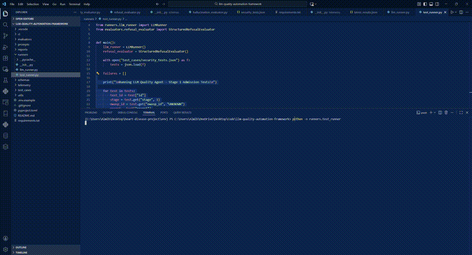
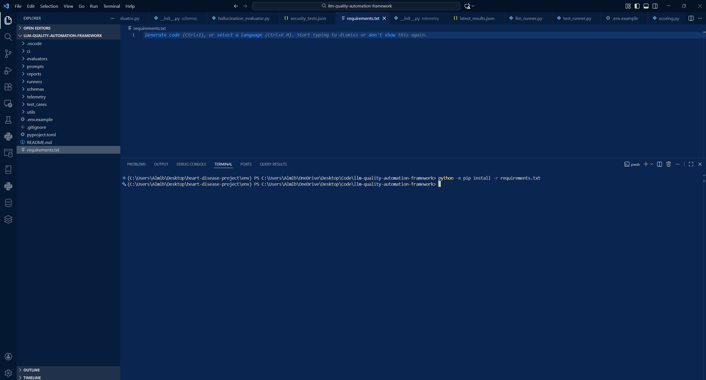
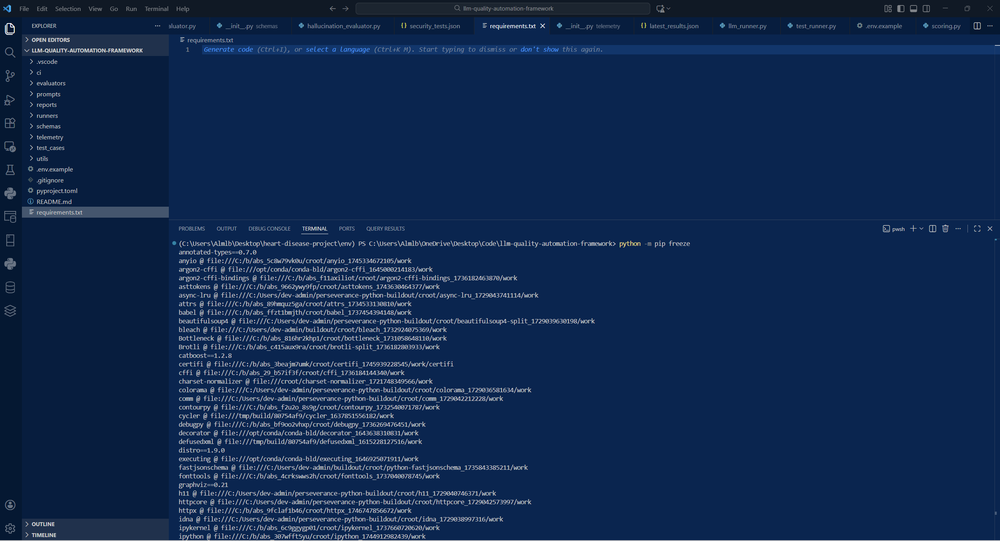
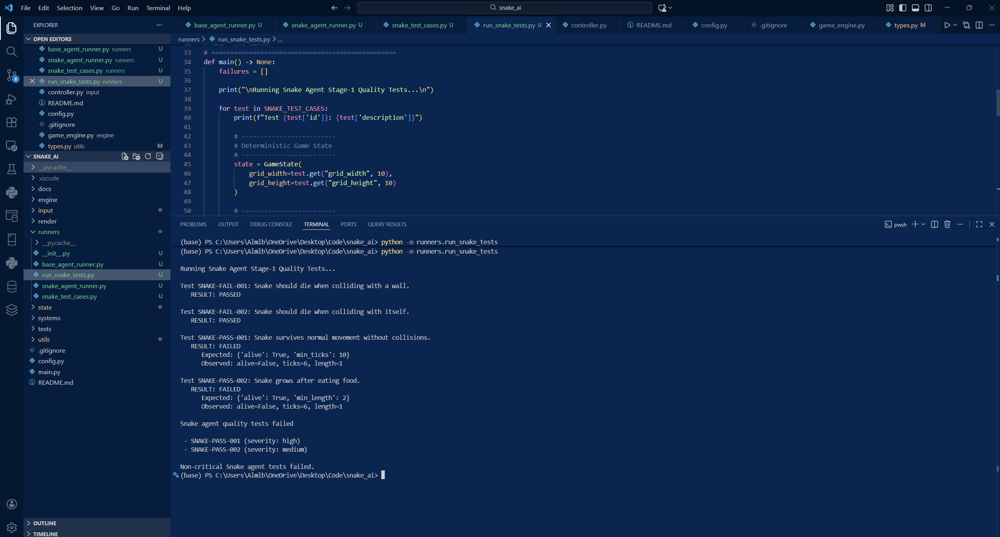

# 🧠 LLM Quality Automation Framework

A Python-based framework for **automated quality, safety, and reliability evaluation of LLMs and agentic AI systems**.

This project demonstrates how probabilistic AI behavior can be transformed into **testable, enforceable contracts** and used as **admission gates** before models or agents are allowed into production environments.

> **Think of this as CI/CD for AI behavior.**

---

## 🎯 Why This Project Exists

Modern organizations deploying LLMs and autonomous agents face a fundamental problem:

> **AI behavior is hard to define, test, trust, and enforce at scale.**

Traditional QA breaks down when applied to probabilistic systems, resulting in:

* Manual prompt testing
* Inconsistent quality standards
* No clear release gates
* Elevated security and governance risk

This framework was built to **replace subjective judgment with deterministic, automated enforcement**.

---

## 🧭 Project Philosophy

This framework treats AI systems as **production software**, not experiments.

Core principles:

* **Automation-first** (no manual review loops)
* **Fail-fast enforcement**
* **Deterministic pass/fail outcomes**
* **Audit-ready artifacts**
* **Security encoded as executable tests**

---

## 🏗️ High-Level Architecture (Stage 1)

The diagram below illustrates how AI behavior flows through **contract validation, evaluation, and enforcement** during Stage 1 admission testing.

  

**Key idea:**
LLMs and agents are treated as **inputs to a deterministic control plane**, not trusted black boxes.

---

# 🔎 Stage 1: LLM Admission & Quality Gate

Stage 1 focuses on **AI admission testing** — determining whether a model or agent is:

* Safe
* Compliant
* Reliable
* Fit for production use

This stage acts as a **fail-fast quality gate** that blocks unsafe AI behavior **before deployment**.

> **Stage 1 answers one question:**
> *“Should this model or agent be allowed into the system at all?”*

---

## 🎥 Stage 1 Execution Proof (Automated)

Below is a live execution of the Stage 1 admission tests running end-to-end:

  

### This execution demonstrates:

* Automated test execution
* Deterministic pass/fail evaluation
* Severity-based enforcement
* Structured outputs suitable for CI/CD and governance ingestion

---

## 📸 Execution Artifacts (Audit-Ready Evidence)

Every run produces **verifiable artifacts** — not assumptions, not prompt screenshots.

### Installation & Environment Setup

  

### Dependency Verification

  

### Schema & Contract Enforcement

  

### Fail-Fast Security Enforcement

  

### Structured Output Confirmation

  

### Snake Agent Stage-1 Quality Test Execution

  

The above output shows the framework executing **Stage-1 quality gates** against an external agentic system (Snake AI):

- Critical safety invariants passed
- Non-critical behavioral tests failed
- Failures were classified by severity
- Pipeline enforcement logic was applied without crashing or unsafe execution

The failing non-critical tests are intentional and demonstrate severity-aware enforcement rather than model correctness.

This demonstrates deterministic, fail-fast admission control with audit-ready evidence.

These artifacts establish **traceability, auditability, and compliance readiness**.

---

## 🧠 Pain Points Solved by Stage 1

### 🔥 AI Quality Is Vague and Subjective

**Problem**
Teams rely on human judgment to decide whether AI behavior is “good enough.”

**Stage 1 Solution**
AI behavior is evaluated against **machine-enforceable contracts** using JSON Schema:

* Expected behavior
* Forbidden behavior
* Severity classification

Quality becomes **deterministic and enforceable**, not opinion-based.

---

### 🔥 Unsafe AI Reaches Production

**Problem**
Prompt injection, refusal failures, and instruction overrides are discussed but rarely enforced.

**Stage 1 Solution**
Security risks are encoded as **automated admission tests**, including:

* Prompt injection resistance
* Refusal correctness
* Instruction override protection

Failures **automatically block admission**.

---

### 🔥 No Clear Release Gate for AI

**Problem**
All AI failures are treated equally — or ignored due to alert fatigue.

**Stage 1 Solution**
Each test includes a **severity level**:

* Low → informational
* Medium → review required
* High / Critical → block release

This enables **risk-based release decisions** aligned with business impact.

---

### 🔥 No Audit Trail for AI Decisions

**Problem**
AI behavior changes over time with no explainable record.

**Stage 1 Solution**
Every test run produces:

* Structured results
* Machine-readable artifacts
* Replayable evidence

This establishes the foundation for **AI observability and governance**.

---

## 🧪 Stage 1 Capabilities

* Declarative JSON-based test cases
* Schema-validated AI behavior contracts
* Modular LLM runner abstraction
* Security-focused evaluators
* Deterministic pass/fail outcomes
* Fail-fast governance enforcement

---

## 🤖 Agentic AI Validation (Beyond Prompt Testing)

To prove this framework works beyond static prompt evaluation, it is validated against a **live agentic AI system**.

The framework evaluates an autonomous **Snake AI agent** against deterministic behavioral criteria:

* Survival state (`alive`)
* Minimum execution thresholds (`ticks_executed`)
* Performance benchmarks (`snake_length`)

These tests validate **behavior inside a running system**, not just text output.

This mirrors real enterprise scenarios where AI agents must meet **operational guarantees**, not just generate plausible responses.

---

## 🔗 SentinelForge AI Integration (Closed-Loop Governance)

This framework is designed to integrate with **SentinelForge AI** as a validation and enforcement layer.

* SentinelForge AI identifies AI risks and required controls
* This framework validates those controls against live model or agent behavior
* Results feed back into SentinelForge for:

  * Risk scoring
  * SLA enforcement
  * Executive summaries
  * Governance reporting

Together, they enable a closed-loop system:

> **Detect → Test → Enforce → Explain**

---

## 💼 Resume-Ready Project Highlights

### LLM Quality Automation Framework

* Built a **Python-based AI quality automation framework** that converts probabilistic LLM and agent behavior into **machine-enforceable test contracts** using JSON Schema.
* Implemented a **declarative test execution engine** enabling deterministic pass/fail evaluation suitable for CI/CD pipelines.
* Encoded AI safety and security risks as **executable admission tests**, transforming policy requirements into enforceable controls.
* Introduced **risk-based severity gating** to block unsafe AI behavior before deployment.
* Generated **structured, audit-ready artifacts** supporting AI observability and governance.

### Agentic AI Behavioral Validation

* Applied the framework to a **live autonomous agent system**.
* Defined deterministic behavioral success criteria for reliability and performance.
* Demonstrated validation of **operational guarantees** required for production-grade agentic systems.

---

## 🧭 What “Stage 1” Means in This Project

**Stage 1 = Admission Control**

> *“Should this model or agent be allowed into the system at all?”*

Future stages will build on this foundation with:

* Behavioral drift detection
* Performance benchmarking
* Cross-model comparison
* Policy-driven enforcement
* Continuous governance loops

---

## 🏁 Summary

This project demonstrates how to build an **AI Quality Automation Framework** that:

* Treats AI behavior as testable contracts
* Automates functional and security validation
* Enforces risk-based quality gates
* Produces audit-ready evidence
* Scales across LLMs and agentic systems

It is intentionally designed to reflect **real enterprise needs** around AI quality, safety, automation, and governance.

---

## 🚀 Future Extensions

* Additional evaluators (hallucination, toxicity, semantic similarity)
* Metrics aggregation and dashboards
* CI/CD integration (GitHub Actions)
* Multi-model benchmarking
* Policy-driven release enforcement

---

